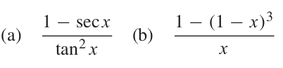
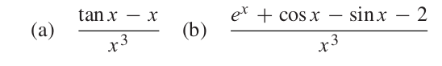

# Chapter 0 Fundamentals  

## 0.1 Evaluating a Polynomial  


[01_poly.hpp](./01_poly.hpp)  
[01_poly.cpp](./01_poly.cpp)  

```cpp
#include"poly.hpp"  

using namespace::std;

int main(){
    Poly p(4, {-1,5,-3,3,2}, 0.5);
    cout << p.get() << endl;
}
```

`g++ 01_poly.cpp`  
`./a.out`  

```
1.25
```

### Computer Problems  

#### 1. Use the function nest to evaluate P (x) = 1 + x + · · · + x 50 at x = 1.00001. (Use the Matlab ones command to save typing.) Find the error of the computation by comparing with the equivalent expression Q(x) = (x 51 − 1)/(x − 1).

[01_1_CP.cpp](./01_1_CP.cpp)  

```
➜  ch00 git:(main) ✗ g++ 01_1_CP.cpp
➜  ch00 git:(main) ✗ ./a.out
Function Q:   51.012752082745230
Polynomial:   51.012752082749991
```  

#### 2. Use nest.m to evaluate P (x) = 1 − x + x 2 − x 3 + · · · + x 98 − x 99 at x = 1.00001. Find a simpler, equivalent expression, and use it to estimate the error of the nested multiplication.

[01_2_CP.cpp](./01_2_CP.cpp)  

```
➜  ch00 git:(main) ✗ g++ 01_2_CP.cpp
➜  ch00 git:(main) ✗ ./a.out
-0.000500
```   

## 0.4 Loss of Significance  

### Computer Problems  

#### 1. Calculate the expressions that follow in double precision arithmetic (using Matlab, for example) for x = 10^−1 , . . . , 10^−14 . Then, using an alternative form of the expression that doesn’t suffer from subtracting nearly equal numbers, repeat the calculation and make a table of results. Report the number of correct digits in the original expression for each x.  

  

[04_1_CP.cpp](./04_1_CP.cpp)  

```cpp
#define SEC(x) (1/cos(x))

inline double oldA(double x){
    return (1-SEC(x))/pow(tan(x),2);
}

inline double newA(double x){
    return -1/(SEC(x)+1);
}

inline double oldB(double x){
    return (1-pow(1-x,3))/x;
}

inline double newB(double x){
    return 3-3*x+pow(x,2);
}

```

```
➜  ch00 git:(main) ✗ g++ 04_1_CP.cpp
➜  ch00 git:(main) ✗ ./a.out
Old-A
10^-1    -0.498748
10^-2    -0.499987
10^-3    -0.500000
10^-4    -0.500000
10^-5    -0.500000
10^-6    -0.500044
10^-7    -0.510703
10^-8    0.000000
10^-9    0.000000
10^-10    0.000000
10^-11    0.000000
10^-12    0.000000
10^-13    0.000000
10^-14    0.000000
New-A
10^-1    -0.498748
10^-2    -0.499987
10^-3    -0.500000
10^-4    -0.500000
10^-5    -0.500000
10^-6    -0.500000
10^-7    -0.500000
10^-8    -0.500000
10^-9    -0.500000
10^-10    -0.500000
10^-11    -0.500000
10^-12    -0.500000
10^-13    -0.500000
10^-14    -0.500000
Old-B
10^-1    2.710000
10^-2    2.970100
10^-3    2.997001
10^-4    2.999700
10^-5    2.999970
10^-6    2.999997
10^-7    3.000000
10^-8    3.000000
10^-9    3.000000
10^-10    3.000000
10^-11    3.000000
10^-12    2.999934
10^-13    3.000933
10^-14    2.997602
New-B
10^-1    2.710000
10^-2    2.970100
10^-3    2.997001
10^-4    2.999700
10^-5    2.999970
10^-6    2.999997
10^-7    3.000000
10^-8    3.000000
10^-9    3.000000
10^-10    3.000000
10^-11    3.000000
10^-12    3.000000
10^-13    3.000000
10^-14    3.000000
```

#### 2. Find the smallest value of p for which the expression calculated in double precision arithmetic at x = 10^−p has no correct significant digits. (Hint: First find the limit of the expression as x → 0.)



[04_2_CP.cpp](./04_2_CP.cpp)  

```
➜  ch00 git:(main) ✗ g++ 04_2_CP.cpp
➜  ch00 git:(main) ✗ ./a.out
A:  
10^-1: 0.334672
10^-2: 0.333347
10^-3: 0.333333
10^-4: 0.333333
10^-5: 0.333333
10^-6: 0.333307
10^-7: 0.330872
8 is the value that resulted in an incorrect significant digits.


B:  
10^-1: 0.341667
10^-2: 0.334167
10^-3: 0.333417
10^-4: 0.333511
10^-5: 0.444089
6 is the value that resulted in an incorrect significant digits.
```

#### 3. Evaluate the quantity a + sqrt(a^2 + b^2) to four correct significant digits, where a = −12345678987654321 and b = 123.   

[04_3_CP.cpp](./04_3_CP.cpp)  

> long double is needed.  

```
➜  ch00 git:(main) ✗ g++ 04_3_CP.cpp
➜  ch00 git:(main) ✗ ./a.out
Old version:    -1.00000000000000000000
New version:    0.00000000000061272450
```

#### 4. Evaluate the quantity sqrt(c^2 + d) − c to four correct significant digits, where c = 246886422468 and d = 13579.  

[04_4_CP.cpp](./04_4_CP.cpp)  

```
➜  ch00 git:(main) ✗ g++ 04_4_CP.cpp
➜  ch00 git:(main) ✗ ./a.out
Old version:    0.00000000000000000000
New version:    0.00000002750049975259
```  

#### 5. Consider a right triangle whose legs are of length 3344556600 and 1.2222222. How much longer is the hypotenuse than the longer leg? Give your answer with at least four correct digits.  

[04_5_CP.cpp](./04_5_CP.cpp)  

```
➜  ch00 git:(main) ✗ g++ 04_5_CP.cpp
➜  ch00 git:(main) ✗ ./a.out
Old version:    0.00000000000000000000
New version:    0.00000000022332214473
```


