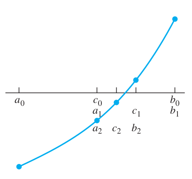

# Chapter 1 Solving Equations  


## 1.1 The Bisection Method  

  
[11_Bisect.hpp](./11_Bisect.hpp)  
[11_Bisect.cpp](./11_Bisect.cpp)  

`g++ 11_Bisect.cpp`  
`./a.out`  

```
EXAMPLE1.1:    0.682328
EXAMPLE1.2:    0.739085
```  

## 1.2 Fixed Points of a Function  

[12_Fixed_Point.cc](./12_Fixed_Point.cc)  
[12_Fixed_Point.hh](./12_Fixed_Point.hh)  

`g++ 12_Fixed_Point.cc`  
`./a.out 0.5`  

It depends on the slope(or derivative) of the function. If the absolute value of derivative < 1, then it will converge.  

```
espeon@Espeon:~/work/Numerical-Analysis/ch01$ ./a.out 0.9
x = 1 - x^3: 
0: 0.9000000000000
1: 0.2710000000000
2: 0.9800974890000
3: 0.0585270867502
4: 0.9997995201533
5: 0.0006013189716
6: 0.9999999997826
7: 0.0000000006523
8: 1.0000000000000
9: 0.0000000000000
10: 1.0000000000000
11: 0.0000000000000
12: 1.0000000000000
13: 0.0000000000000
14: 1.0000000000000
15: 0.0000000000000
16: 1.0000000000000
17: 0.0000000000000
18: 1.0000000000000
19: 0.0000000000000
20: 1.0000000000000
21: 0.0000000000000
22: 1.0000000000000
23: 0.0000000000000
24: 1.0000000000000
25: 0.0000000000000
26: 1.0000000000000
27: 0.0000000000000
28: 1.0000000000000
29: 0.0000000000000
30: 1.0000000000000
31: 0.0000000000000
32: 1.0000000000000
33: 0.0000000000000
34: 1.0000000000000
35: 0.0000000000000
36: 1.0000000000000
37: 0.0000000000000
38: 1.0000000000000
39: 0.0000000000000
40: 1.0000000000000
41: 0.0000000000000
42: 1.0000000000000
43: 0.0000000000000
44: 1.0000000000000
45: 0.0000000000000
46: 1.0000000000000
47: 0.0000000000000
48: 1.0000000000000
49: 0.0000000000000
--------------------------
x = (1 - x)^1/3: 
0: 0.9000000000000
1: 0.4641588833613
2: 0.8122293494191
3: 0.5726323822752
4: 0.7532408601733
5: 0.6272265247069
6: 0.7196947492651
7: 0.6544509126967
8: 0.7017297949166
9: 0.6681438228540
10: 0.6923355548108
11: 0.6750860028976
12: 0.6874737820807
13: 0.6786233813199
14: 0.6849698025511
15: 0.6804309533581
16: 0.6836831907812
17: 0.6813560089780
18: 0.6830228679565
19: 0.6818297979165
20: 0.6826841731418
21: 0.6820725599237
22: 0.6825105009508
23: 0.6821969737529
24: 0.6824214609027
25: 0.6822607419237
26: 0.6823758145163
27: 0.6822934280591
28: 0.6823524148339
29: 0.6823101827210
30: 0.6823404197143
31: 0.6823187711584
32: 0.6823342708542
33: 0.6823231736235
34: 0.6823311188825
35: 0.6823254303523
36: 0.6823295031525
37: 0.6823265871667
38: 0.6823286749155
39: 0.6823271801582
40: 0.6823282503544
41: 0.6823274841300
42: 0.6823280327209
43: 0.6823276399484
44: 0.6823279211603
45: 0.6823277198220
46: 0.6823278639735
47: 0.6823277607659
48: 0.6823278346591
49: 0.6823277817540
--------------------------
x = (1 + 2 * x^3)/(1 + 3 * x^2): 
0: 0.9000000000000
1: 0.7166180758017
2: 0.6833069049626
3: 0.6823286219956
4: 0.6823278038286
5: 0.6823278038280
6: 0.6823278038280
7: 0.6823278038280
8: 0.6823278038280
9: 0.6823278038280
10: 0.6823278038280
11: 0.6823278038280
12: 0.6823278038280
13: 0.6823278038280
14: 0.6823278038280
15: 0.6823278038280
16: 0.6823278038280
17: 0.6823278038280
18: 0.6823278038280
19: 0.6823278038280
20: 0.6823278038280
21: 0.6823278038280
22: 0.6823278038280
23: 0.6823278038280
24: 0.6823278038280
25: 0.6823278038280
26: 0.6823278038280
27: 0.6823278038280
28: 0.6823278038280
29: 0.6823278038280
30: 0.6823278038280
31: 0.6823278038280
32: 0.6823278038280
33: 0.6823278038280
34: 0.6823278038280
35: 0.6823278038280
36: 0.6823278038280
37: 0.6823278038280
38: 0.6823278038280
39: 0.6823278038280
40: 0.6823278038280
41: 0.6823278038280
42: 0.6823278038280
43: 0.6823278038280
44: 0.6823278038280
45: 0.6823278038280
46: 0.6823278038280
47: 0.6823278038280
48: 0.6823278038280
49: 0.6823278038280
--------------------------
```